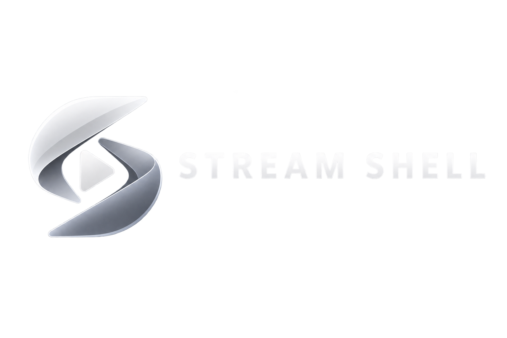

  

# Stream Shell

Stream Shell is a personal Opera GX / Chromium extension that turns several streaming services into one managed desktop-style shell. It was built around my own Windows setup and workflow first; other setups may work, but compatibility is best-effort rather than a product promise.

Current public version: **0.17.12**.

## What it does

Stream Shell currently integrates **Netflix, Prime Video, Disney+, Crunchyroll and YouTube** as core providers, with **Twitch** and **Discord** as utility surfaces.

Highlights include:

- Wide and Compact window/layout profiles with provider-aware window management.
- A unified Landing/Dashboard UI with Watchlist, Continue Watching, Recent and Direct entries.
- TMDB metadata/search plus streaming availability through TMDB's watch-provider data.
- Provider automations such as autoplay/skip helpers, playback utilities and provider-specific cleanup.
- YouTube extras including Windowed Fullscreen, Auto-Like, quality handling, upload-date helpers, Shorts tweaks and optional Return YouTube Dislike ratio integration.
- Twitch channel-points/Drops automation, raid guard and audio handling.
- A tab-capture based Volume Booster with a Chromium fullscreen bridge.
- Optional native Windows helpers for Stream Shell titlebars/window controls and Discord desktop integration.
- Settings export/import, diagnostics, self-test/repair paths and resource-governor logic.

## Reality check / support policy

This is primarily a personal project. Development and maintenance are driven by what I use myself. There is no compatibility guarantee, release schedule or support SLA, and provider DOM changes can break features without warning.

Issues and pull requests are welcome, but a public repository does **not** mean every setup-specific request will be implemented. Forking is absolutely fine within the license terms.

## Installation

1. Clone or download this repository.
2. Open `opera://extensions` in Opera GX.
3. Enable **Developer mode**.
4. Choose **Load unpacked** and select the repository root (the folder containing `manifest.json`).
5. Open Stream Shell and configure the features you want.

The extension is Manifest V3 and is primarily developed/tested in Opera GX on Windows.

### Optional: provider backgrounds

Personal background artwork is intentionally not distributed. See [`assets/backgrounds/README.md`](assets/backgrounds/README.md) for the supported filenames. Stream Shell still runs without these files.

### Optional: TMDB

Search, metadata and availability features use a **TMDB Read Access Token** supplied by the user. The token is stored locally in extension storage; no token is included in this repository.

### Optional: Return YouTube Dislike

The YouTube like/dislike ratio display reads the UI produced by the **Return YouTube Dislike** browser extension. If RYD is not installed/active, Stream Shell simply has no dislike-ratio source to display.

### Optional: native Windows helpers

The `native/` folder contains source and installer scripts for two Windows Native Messaging helpers:

- **Titlebar helper** — custom titlebar/window integration.
- **Discord helper** — restores/reuses the stable Discord desktop client and integrates it with the Stream Shell surface switcher.

Read [`native/TITLEBAR-README.txt`](native/TITLEBAR-README.txt) and [`native/README.txt`](native/README.txt) before installing them. The Discord helper resolves the stable client dynamically from `%LOCALAPPDATA%\\Discord` and contains no user-specific executable path.

## Source layout

Stream Shell keeps canonical source fragments next to generated runtime bundles:

- `background/src/` → `background.js`
- `common/src/` → `common/shell.js`
- `landing/src/` → `landing/landing.js`
- `dashboard/src/` → dashboard bundles
- `providers/` → provider content scripts, themes and player helpers
- `media/` → local library / TMDB integration
- `native/` → optional Windows Native Messaging helpers

PowerShell build scripts and `SOURCE-README.txt` files document the bundle order for the larger generated files.

## Privacy / local data

Stream Shell stores its own settings, media library state and optional TMDB token in browser extension storage. Subscription helpers inspect account pages already visible to the signed-in browser session and are designed to retain only the extracted status/renewal information rather than raw page text.

No telemetry service is included in the project.

## License

Stream Shell is **source-available for non-commercial use** under the [PolyForm Noncommercial License 1.0.0](LICENSE.md). Redistribution and modifications are allowed under those terms, and the required copyright/original-author notices must be preserved.

This is deliberately not presented as an OSI-approved open-source license because commercial use is restricted.

Copyright © 2026 **Sven Rieseler**.

## Third-party services and trademarks

Stream Shell is independent and is not affiliated with or endorsed by the services it integrates. Netflix, Prime Video/Amazon, YouTube/Google, Disney+, Crunchyroll, Twitch, Discord, TMDB, JustWatch and Return YouTube Dislike are names/trademarks/projects of their respective owners.
