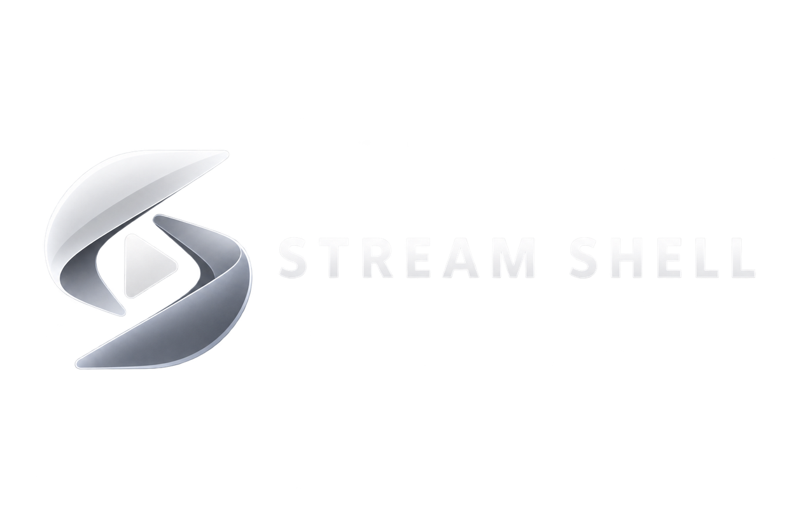

  

# Stream Shell

Stream Shell is a personal Opera GX / Chromium extension that turns several streaming services into one managed desktop-style shell. It is built around my own Windows setup and workflow first; compatibility with other setups is best-effort.

Current package version: **0.19.21**.

## Features

Stream Shell integrates **Netflix, Prime Video, Disney+, Crunchyroll and YouTube** as core providers, with **Twitch** and **Discord** as utility surfaces.

- Wide 32:9 and Compact 16:9/16:10 layouts with provider-aware window management.
- Unified Landing/Dashboard with Watchlist, Continue Watching, Recent and Direct entries.
- Provider-specific playback helpers, autoplay/skip automation and cleanup.
- YouTube utilities including Windowed Fullscreen, Auto-Like, quality handling and optional Return YouTube Dislike integration.
- Twitch four-slot Wide Workspace with persistent Twitch windows, per-slot controls, Drops/channel-points automation and configurable anti-raid behavior.
- Tab-capture Volume Booster with Chromium fullscreen support.
- Optional native Windows helpers, Unified Remote integration and COBOL-backed subscription finance report.
- Settings export/import, diagnostics and self-test/repair tools.

## Installation

1. Clone or download this repository.
2. Open `opera://extensions` in Opera GX.
3. Enable **Developer mode**.
4. Choose **Load unpacked** and select the repository root containing `manifest.json`.
5. Open Stream Shell and configure the features you want.

Stream Shell uses Manifest V3 and is primarily developed/tested in Opera GX on Windows.

## Optional integrations

- **TMDB** — metadata, search and watch-provider availability. Requires your own TMDB Read Access Token.
- **Return YouTube Dislike** — optional source for YouTube like/dislike ratio data.
- **Native Windows helpers** — titlebar/window integration and Discord desktop integration. See [`native/TITLEBAR-README.txt`](native/TITLEBAR-README.txt) and [`native/README.txt`](native/README.txt).
- **Unified Remote** — custom remote under [`integrations/unified-remote/`](integrations/unified-remote/).
- **COBOL finance** — optional Wide-only subscription finance surface backed by GnuCOBOL. See [`integrations/cobol-finance/README.md`](integrations/cobol-finance/README.md).

Provider artwork is bundled under [`assets/backgrounds/`](assets/backgrounds/) and can be replaced locally.

## Source layout

- `background/src/` → background runtime
- `common/src/` → shared shell runtime
- `landing/src/` and `dashboard/src/` → UI source
- `providers/` → provider scripts, themes and player helpers
- `media/` → local library / TMDB integration
- `native/` → optional Windows Native Messaging helpers
- `integrations/` → optional external integrations

Build scripts and `SOURCE-README.txt` files document generated bundle order where needed.

## Privacy

Stream Shell stores its settings, media-library state and optional TMDB token locally in browser extension storage. No telemetry service is included.

## Reality check / support policy

This is primarily a personal project. Development follows my own use cases, and there is no compatibility guarantee, release schedule or support SLA. Provider DOM changes may break features without warning.

Issues and pull requests are welcome, and forking is fine within the license terms.

## License

Stream Shell is **source-available for non-commercial use** under the [PolyForm Noncommercial License 1.0.0](LICENSE.md).

Copyright © 2026 **Sven Rieseler**.

## Third-party services and trademarks

Stream Shell is independent and is not affiliated with or endorsed by the services it integrates. Netflix, Prime Video/Amazon, YouTube/Google, Disney+, Crunchyroll, Twitch, Discord, TMDB, JustWatch, Return YouTube Dislike and Unified Remote are names/trademarks/projects of their respective owners.
